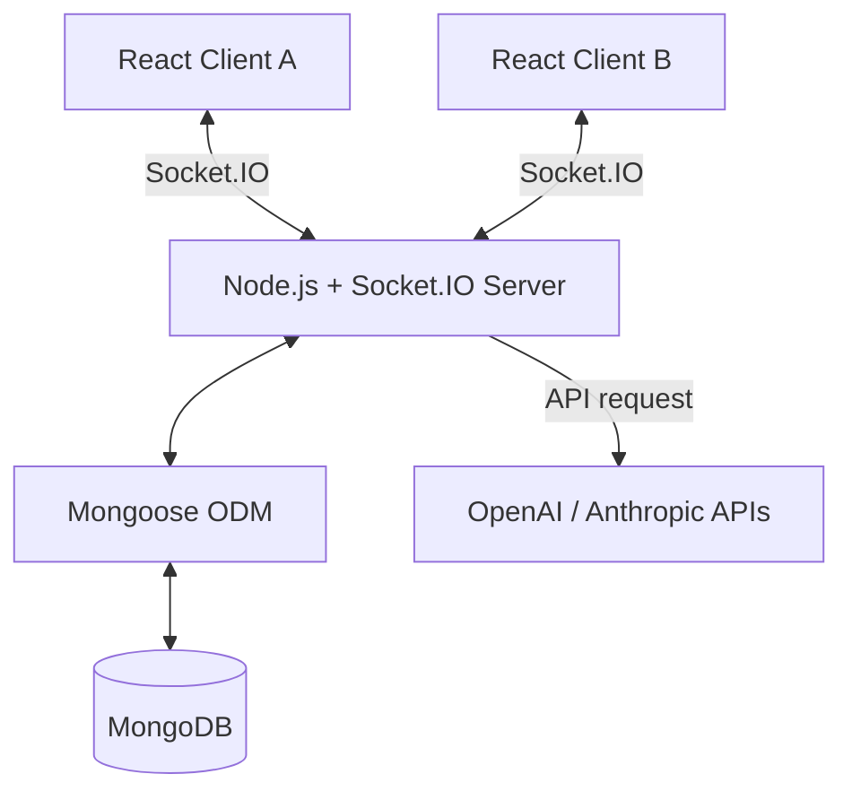

# 💻 CollabCode Review — Real-Time Collaborative Code Review Tool

A production-ready, full-stack collaborative environment for real-time code reviews. Features include dynamic syntax-highlighted editing with Monaco Editor, inline multi-threaded line comments (similar to GitHub PR reviews), live cursor tracking, and instant automated AI Code Reviews.

---

## 📸 Visual Previews

| Code Editor & Comments Sidebar | AI Code Review Panel & Score Gauge |
| ----------------------------- | ---------------------------------- |
| *[Insert Editor Screenshot/GIF]* | *[Insert AI Review Screenshot/GIF]* |

---

## 🏗️ Architecture Overview

The application is built on a decoupled MERN stack architecture utilizing stateful WebSocket connections for instant operational synchronization.



### 🔴 Real-Time Room-Based Synchronization
1. **Connection & Auth**: When a participant joins a session, a WebSocket handshake is authorized using a JWT token.
2. **Room Isolation**: The socket server subscribes the client to a specific Room channel using `socket.join(sessionId)`.
3. **Optimistic Sync**:
   - Code edits, cursor movements, and text selections are broadcast instantly to other room members using `socket.to(sessionId).emit(...)`.
   - Monaco Editor handles character insertion and layout calculations locally for each user.
4. **Debounced DB Persistence**:
   - To reduce database overhead, changes are held in-memory on the socket server.
   - A debounced auto-save timer writes the latest code to MongoDB 3 seconds after typing stops. Users can also force an immediate save with `Ctrl+S`.

---

## 🧰 Tech Stack

| Layer | Technologies |
|-------|--------------|
| **Frontend** | React 18, Vite, Tailwind CSS 3 |
| **State & Queries** | Zustand (persistent auth), TanStack Query (cached CRUD & mutations) |
| **Code Editor** | Monaco Editor (`@monaco-editor/react`) with custom cursor overlays |
| **Real-time Sync** | Socket.IO Client & Server (WebSocket & polling fallbacks) |
| **Backend** | Node.js, Express 4, Winston Logger |
| **Database** | MongoDB, Mongoose 8 (indexed queries) |
| **AI Integration** | OpenAI (GPT-4o-mini), Anthropic (Claude-3-5-Sonnet) |

---

## 🚀 Getting Started

### Project Layout
```
collab-code-review/
├── backend/                    # Node.js Express server + Socket.IO handlers
│   ├── Dockerfile
│   └── src/
└── frontend/                   # React web dashboard + Monaco editor
    ├── Dockerfile
    ├── nginx.conf
    └── src/
docker-compose.yml              # Multi-container local orchestra
.env.example                    # Template for environment configurations
```

---

### 🐳 Option A: Setup in 60 seconds with Docker Compose (Recommended)

Spins up the React client, Node.js server, and MongoDB instance instantly.

1. **Clone the repository** and make sure Docker is running on your machine.
2. **Launch all services**:
   ```bash
   docker-compose up --build
   ```
3. Open **`http://localhost:8080`** in your browser. The backend API is reachable at `http://localhost:5000/api`.

---

### 💻 Option B: Manual Local Setup

#### Prerequisites
* Node.js >= 18
* MongoDB running locally (default: `mongodb://localhost:27017`)

#### 1. Backend Setup
```bash
cd collab-code-review/backend

# Copy variables template
cp .env.example .env

# Install Node modules
npm install

# Start in development mode (with nodemon)
npm run dev
```

#### 2. Frontend Setup
In a new terminal window:
```bash
cd collab-code-review/frontend

# Install dependencies
npm install

# Start Vite dev server
npm run dev
```
Open **`http://localhost:5173`** to access the dashboard.

---

## 🤖 AI Code Review Engine

When a review is triggered (`POST /api/sessions/:sessionId/ai-review`), the backend analyzes the code and returns a structured JSON payload:
- **Bugs & Code Smells**: Inline Monaco decoration squigglies are drawn relative to severity.
- **Hover Messages**: Rich markdown tooltips display refactoring steps and warnings.
- **Quality Score**: A circular progress gauge dynamically rates the overall code quality.

*Note: If no API keys are provided in `.env`, the system automatically falls back to an intelligent, local regex-based analyzer to ensure it runs out-of-the-box.*

---

## 🌐 Deployment Guidelines

### ⚠️ Critical Note on Serverless Hosting (e.g. Vercel/Netlify for Backend)
> [!IMPORTANT]
> **Socket.IO requires a persistent server connection.** 
> You **cannot** host the backend/Socket.IO service on serverless platforms like Vercel Serverless Functions or Netlify Functions because they do not support persistent TCP/WebSocket connections.
> 
> - **Frontend**: Can be safely deployed to **Vercel**, **Netlify**, or any static web host.
> - **Backend**: Must be deployed to a persistent server environment such as **Render (Web Service)**, **Railway**, **Fly.io**, **Heroku**, or a dedicated **VPS/Docker** environment.

### Deploying the Backend on Render
1. Create a new **Web Service** on Render.
2. Connect your GitHub repository.
3. Configure the following build settings:
   - **Root Directory**: `collab-code-review/backend`
   - **Build Command**: `npm install`
   - **Start Command**: `npm start`
4. Add environment variables:
   - `MONGO_URI`: Your MongoDB Atlas connection string.
   - `JWT_SECRET`: A long secure string.
   - `CLIENT_ORIGIN`: The URL of your deployed frontend.

### Deploying the Frontend on Vercel
1. Create a new project on Vercel.
2. Connect your GitHub repository.
3. Configure the following build settings:
   - **Root Directory**: `collab-code-review/frontend`
   - **Build Command**: `npm run build`
   - **Output Directory**: `dist`
4. Add environment variables:
   - `VITE_API_BASE_URL`: `https://your-backend.onrender.com/api`
   - `VITE_SOCKET_URL`: `https://your-backend.onrender.com`
